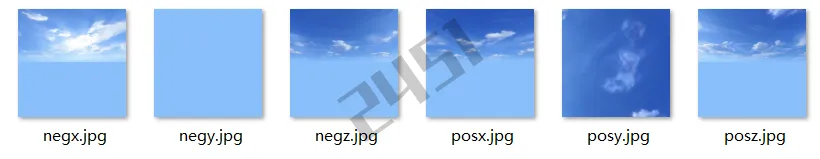

# 效果模块详细指南

## 6. 效果

### 6.1 效果模板

ThingJS 引擎提供了效果模板的功能，通过设置对象的style、环境和后期、特效地面等方式，实现对场景效果的整体切换。例如：从室外进入室内的效果切换，从实景风格到科幻风格的效果切换。

效果模板可以由 ThingJS 编辑器制作，具体方法参考编辑器的相关文档。

效果模板的数据可以和其他场景数据一起存储，随场景一起加载，也可以存储到单独的文件中，使用app.load()方法加载：

```javascript
// 加载效果模板，立即生效
await app.load('./themes/bundle.json')
```

效果模板在加载后默认立即生效，如果不希望立即生效可设置apply参数为false，当需要时再调用apply()，下面以单独加载效果模板文件为例：

```javascript
// 加载效果模板，但不立即生效
let theme = await app.load('./themes/bundle.json', {
  apply: false，	 // 默认为true  是否应用效果模板
  root: Object3D,     // 应用到的物体

  // 默认为false， 是否忽略renderSettrings(为true时不应用)
  ignoreRenderSettings: false,

  // 默认为false， 是否忽略styles(为true时不应用)
  ignoreStyles: false,

  // 默认为false， 是否不创建粒子(为true时不创建)
  ignoreParticles: false,

  // 默认为false， 是否不创建特效地面(为true时不创建)
  ignoreEffectGrounds: false,

  // 默认为false， 是否不创建外装效果(为true时不创建)
  ignoreEffectFacades: false
});

// 加载效果模板apply: false 配置时候，按需让其生效
theme.apply();
```

注意：加载和初始化效果模板需要消耗一定的性能，所以可以预先加载效果模板，但不立即生效，等需要时再生效，会有助于提升切换效果模板的效率。

### 6.2 环境

ThingJS 引擎的环境设置部分支持对场景的多方面进行调整，包括背景图片、天空效果、环境贴图、灯光配置以及后期处理效果等。这些设置增强了场景的真实感效果或独特的风格化效果。

#### 背景和天空

可以通过app.background属性，来设置背景颜色或天空盒：

```javascript
// 设置背景颜色
app.background = '#0000FF'
```

直接设置图片作为背景：

```javascript
app.background = './images/bluesky/posx.jpg'
```

设置天空盒作为背景，需要指定 6 个图片文件的地址：

```javascript
const baseURL = './images/bluesky/'
const cubeMap = new THING.CubeTexture([
  baseURL + 'posx.jpg',
  baseURL + 'negx.jpg',
  baseURL + 'posy.jpg',
  baseURL + 'negy.jpg',
  baseURL + 'posz.jpg',
  baseURL + 'negz.jpg'
])
app.background = cubeMap
```

也可以直接指定一个路径，但需要路径中的天空盒文件的命名按照一定的规则，需要注意图片大小以及文件名的先后次序，图片的宽高比必须为1:1，并且每张图片大小必须一致。文件名对应天空盒的空间关系，如下图所示：



```javascript
/**
  './images/Night/negx.jpg', // 左
  './images/Night/negy.jpg', // 下
  './images/Night/negz.jpg', // 后
  './images/Night/posx.jpg', // 右
  './images/Night/posy.jpg', // 上
  './images/Night/posz.jpg'  // 前
 */
let cubeMap = new THING.CubeTexture({
  url: './images/Night/' // 贴图的文件夹路径
})
app.background = cubeMap
```

直接设置app.background为null即可清空背景：

```javascript
app.background = null
```

#### 环境图

环境图通常被用于实现材质的各种反射效果，例如玻璃、水面、金属等，引擎提供了场景中默认的环境图。环境图是一个THING.CubeTexture，用户可以通过app.envMap来设置场景的环境图，或通过对象的obj.style.envMap属性来设置对象的环境图：

```javascript
// 全局环境图设置
app.envMap = cubeMap

// 对象样式的环境图设置
obj.style.envMap = cubeMap
```

直接设置app.envMap为null即可清空环境图：

```javascript
// 关闭全局环境贴图
app.envMap = null
// 关闭单个物体的环境贴图
obj.style.envMap = null
```

#### 雾

用于模拟室外环境中的雾或雾气，可以通过app.camera.fog设置雾的效果：

```javascript
// 创建用于观察雾效果的平面
let plane = new THING.Plane(10, 10)
// 开启雾的效果
app.camera.fog.enable = true
// 设置雾的远平面距离
app.camera.fog.far = 30
// 设置雾的颜色
app.camera.fog.color = 'red'
```

#### 灯光

ThingJS 引擎在场景中默认提供了 环境光 和 一个主光源，可以通过 app.scene.ambientLight 和 app.scene.mainLight 来访问：

```javascript
// 获取场景默认环境光
const ambientLight = app.scene.ambientLight
// 获取场景默认直射光
const mainLight = app.scene.mainLight
```

可以通过灯光的颜色color属性、强度intensity属性、阴影castShadow属性等对灯光进行调整，注意在使用阴影前需要一些物体来反映阴影效果：

```javascript
// 生成地面
const plane = new THING.Plane(100, 100)
// 生成两个box
const box1 = new THING.Box({
  position: [0, 5, 0]
})
const box2 = new THING.Box({
  position: [3, 5, 0],
  style: {
    color: 'blue'
  }
})

// 设置环境光的颜色
ambientLight.color = [0.8, 0.8, 1.0]
// 设置直射光的光照强度
mainLight.intensity = 0.5
// 设置直射光的水平方向角度
mainLight.adapter.horzAngle = 80
// 设置直射光的垂直方向角度
mainLight.adapter.vertAngle = 30

// 直射光开启阴影
mainLight.castShadow = true
// 设置阴影效果品质
mainLight.shadowQuality = THING.ShadowQualityType.High
```

可以创建更多光源，目前支持AmbientLight，DirectionalLight，HemisphereLight，SpotLight，PointLight等几种灯光

```javascript
// 创建朝向地面的聚光灯
const spotLight = new THING.SpotLight({
  rotation: [-90, 0, 0],
  position: [0, 10, 0],
  castShadow: true
})

// 设置环境贴图提供的环境光照：
app.scene.envMapLightIntensity = 0
```

#### 后处理

后处理Post-Processing是指在渲染之后，对最终渲染的结果进行后期加工的过程，用于实现各种特殊效果。在 ThingJS 引擎中后期特效包括全屏后期特效与逐物体后期特效。

可以通过camera.postEffect来设置全屏后处理效果：

```javascript
// 获取当前的后期参数
const config = app.camera.postEffect

// 设置后期参数
app.camera.postEffect = config

// 修改后期设置示例
app.camera.postEffect.colorCorrection.gamma = 1.5 // 设置颜色矫正后期中的gamma值
app.camera.postEffect.chromaticAberration.enable = true // 开启色偏特效
```

关于全屏后期特效，更多设置选项参考：摄像机后期效果组件。

另外，ThingJS 引擎还支持特定物体的发光、勾边等逐物体后期特效。逐物体特效虽然支持物体设置各自的开关与强度值，但其余参数例如发光阈值、发光半径、总开关等等，需要通过camera.effect来进行全局设置：

```javascript
// 在物体的style.effect上支持设置逐物体特效glow，强度为1
object.style.effect.glow = 1

// 通过camera.effect来对这些逐物体特效的整体效果做一些调节
app.camera.effect.glow.enable = true // 总开关，如果为false，那么场景中所有物体的glow效果都会失效
app.camera.effect.glow.strength = 3.5 // 全局特效强度，实际特效强度 = 物体特效强度 * 全局特效强度
app.camera.effect.glow.threshold = 0.1 // glow特效的阈值
```

关于逐物体后期特效，更多设置选项参考：

- 逐物体特效管理
- 逐物体特效列表
