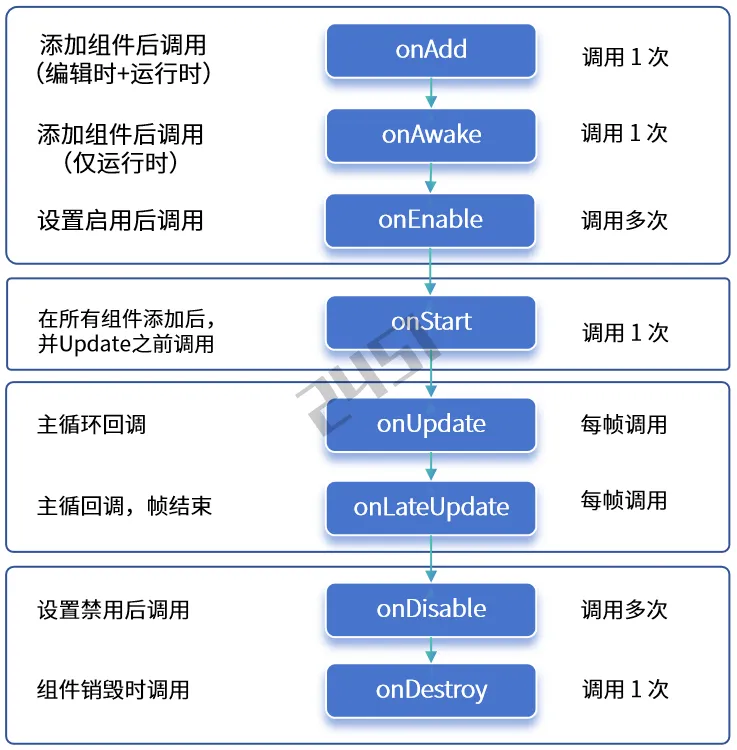
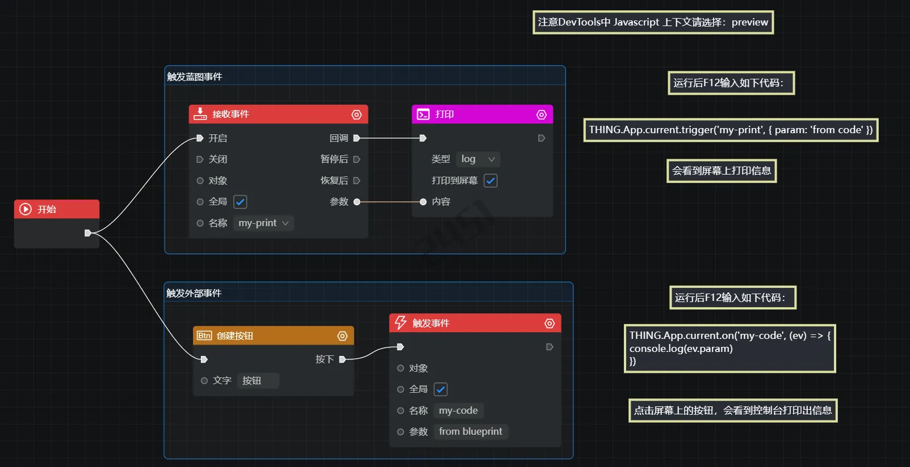

# 扩展方式模块详细指南

## 8. 扩展方式

### 8.1 组件

开发一个组件需要继承自 Component 类，下面是一个组件类的例子：

```javascript
// 对象组件
class MyRotator extends THING.Component {
  // 创建时回调
  onAwake(param) {
    this.speed = param['speed'];
    // 常用成员：
    // this.app、this.camera、this.object;
  }
  // 启动时回调
  onStart() {
    this.object.style.color = '0xFF0000';
  }
  // 更新回调，出于性能考虑，如果不需要更新，应该删掉本方法
  onUpdate(deltaTime) {
    this.object.rotateY(this.speed * deltaTime);
  }
}

// 创建一个对象
let obj = new THING.Entity({
  url: './models/car.gltf';
});

// 给对象添加组件
obj.addComponent(MyRotator, 'rotator');
obj.rotator.speed = 100;
```

#### 生命周期

在组件中，可以实现下列的生命周期方法的回调：



其他生命周期方法例如：onLoad 对象加载资源后的回调，onAppQuit 应用退出时候的回调等。

注意：如果某生命回调方法里没有代码实现，则尽量不要声明这个方法，否则会造成性能浪费，如下：

```javascript
class MyComp extends THING.Component {
  // 虽然没有代码实现，但onUpdate仍然会在每次更新时被调用，
  // 这造成性能浪费，所以应该删除这些"空"方法
  // onUpdate() { }
}
```

#### 添加组件

给对象添加组件addComponent的几种重载方法。当给组件指定名字时，对象身上即可包含这个名字的组件成员：

```javascript
// 通过传入类型名的方式
let rotator = obj.addComponent(MyRotator)
// 传入类型名和组件名称
obj.addComponent(MyRotator, 'rotator')
obj.rotator.speed = 100
// 传入类型名和组件参数
let rotator = obj.addComponent(MyRotator, { speed: 10 })
// 传入类型名、组件名称和组件参数
obj.addComponent(MyRotator, 'rotator', { speed: 10 })
// 传入组件实例、组件名称和组件参数
let rotator = new MyRotator()
obj.addComponent(rotator, 'rotator', { speed: 10 })
```

#### 获取组件

通过对象成员 obj.components 或 getComponent，可以获取对象身上已经添加的组件：

```javascript
// 根据名称获取指定组件
let rotator = obj.getComponentByName('rotator')
// 根据名称获取指定组件
let rotator = obj.components.get('rotator')
// 获取某种类型的组件，返回第一个该类型的组件
let rotator = obj.getComponentByType(MyRotator)
// 获取某种类型的组件，以数组形式返回全部该类型组件
let rotators = obj.getComponentsByType(MyRotator)
// 获取所有已使用的组件
let components = obj.components
// 获取所有组件，返回对象上挂载的所有组件
let components = obj.getAllComponents()
```

#### 禁用删除

通过组件的enable属性可以禁用或启用组件，当组件被禁用后，会调用组件的onDisable，同时onUpdate 也不会再被调用，当启用组件后，会调用组件的onEnable方法。

```javascript
// 禁用组件，调onDisable
obj.rotator.enable = false

// 启用组件，调onEnable
obj.rotator.enable = true
```

可以通过 removeComponent 删除组件：

```javascript
obj.removeComponent('rotator')
```

#### 常用成员

组件提供常用的成员属性，如this.app、this.camera等，其中 this.object 为组件所挂接的对象：

```javascript
class MyComp extends THING.Component {
  onStart() {
    console.log(this.app)
    console.log(this.camera)
    console.log(this.object)
    // ......
  }
}
```

#### 导出成员

可以使用静态数组导出组件的属性和方法，其中 exportProperties 用来导出属性，exportFunctions 用来导出方法，下面的写法，可以将组件的speed属性和setColor方法暴露到对象身上使用：

```javascript
class MyComponent extends THING.Component {
  // 需要导出的属性
  static exportProperties = ['speed']
  // 需要导出的方法
  static exportFunctions = ['setColor']

  speed = 10
  setColor(value) {
    this.object.style.color = value
  }
}

const box = new THING.Box()
box.addComponent(MyComponent)

// 访问导出属性
box.speed = 50

// 访问导出方法
box.setColor(THING.Math.randomColor())
```

### 8.2 预制件

在 ThingJS 引擎中，预制件Prefab是一种预先定义好的资源，作为具有特定属性、行为和效果的对象模板。预制件可以用于需要多次重复创建的对象。例如，在一个场景中，如果有多个具有移动、搬运和装载等行为的叉车对象，就可以制作一个叉车预制件。

预制件的创建与开发，请参考编辑器的 预制件开发 文档。

#### 初始化

预制件的使用方式与Entity相同，区别在于参数中的url指定的是预制件资源地址。此外，还可以传递特定的参数给预制件，以满足这个预制件的需要。

```javascript
// 创建预制件
const obj = new THING.Entity({
  url: './models/car.json',
  speed: 100 // speed参数，是这个预制件的特殊参数
})
await obj.waitForComplete()

// 调用预制件提供的方法
obj.doSomething()
```

#### 文件结构

预制件的文件结构，一般以index.json为默认入口，可能会包含components、blueprints、models等目录：

```
├─ blueprints
│   └─ bpnode.js
├─ components
│   └─ mycomp.js
├─ models
│   └─ spaceman.gltf
└─ index.json
```

入口文件index.json是一个 ThingJS 场景格式的文件，由场景中的对象导出生成，一般会包含了对象字段，以及对组件脚本、蓝图脚本引用的文件等，例如：

```javascript
// index.json
{
  "name": "spaceman",
  "URIs": ["./models/spaceman.gltf"],
  "objects": [{
      "uuid": "9c0e84e81dd84fb3b8ddb3d3fe83b97f",
      "type": "Entity",
      "tags": [0],
      "uri": 0,
      "size": [1.399, 2.292, 3.439],
      "components": [{
          "type": "MyComp",
          "name": "mine",
          "params": {
            "speed": 100
          }
      }],
  }],
  "scripts": [
    "./components/comp.js", // 组件脚本
    "./blueprints/bpnode.js", // 蓝图节点文件
  ]
}
```

### 8.3 插件

ThingJS 引擎的插件（Plugin）是一种扩展系统功能的方式。用户可以在插件中开发自定义代码，使用组件，引用模型、图片等资源，以实现独立功能的封装。例如，可以通过插件为 ThingJS 增加物理系统或寻路系统等功能。在一个 app 中，每个插件只需要注册一个实例。

#### 开发插件

开发一个插件，需要继承 BasePlugin 类，下面是一个插件类的例子：

```javascript
// 插件
class MyPlugin extends THING.BasePlugin {
  constructor(params) {
    super()
    this.box = null
    // 常用成员：this.app、this.camera;
  }
  // 插件方法
  sayHello() {
    console.log('hello MyPlugin!')
  }
  // 插件安装完成
  onInstall(options) {
    // 创建一个Box
    this.box = new THING.Box()
  }
  // 插件卸载完成
  onUninstall() {
    this.box.destroy()
    this.box = null
  }
}
```

可以使用 ThingJS 编辑器来创建一个插件，在菜单中选择 插件管理，选择创建插件，然后根据向导提示，生成一个插件的模板代码。具体请参考编辑器的 插件开发 文档。

ThingJS 编辑器的插件可以提供 编辑态 和 运行态 的功能，其中运行态的功能等同于 ThingJS 引擎中的插件，引擎可以直接使用。编辑态的功能只能在编辑器内使用。

#### 加载卸载

引擎通过app.loadPlugin()方法来加载插件：

```javascript
let url = './plugins/my-plugin/index.js'
let params = {}

// await 的方式，等待加载完成
let plugin = await app.loadPlugin(url, params)
plugin.sayHello()
```

可以在加载插件时指定插件名字，然后调用app.uninstall来卸载这个插件

```javascript
// 加载插件
await app.loadPlugin(url, {
  name: 'my-plugin'
})

// 卸载插件
app.uninstall('my-plugin')
```

### 8.4 自定义类

在 ThingJS 引擎中，对象的基类是BaseObject，引擎提供了一些BaseObject的子类，如：Object3D、Entity、CellSpace、Building、Floor、Room等，除此之外，用户可以通过继承自BaseObject或其他类型，来实现自己的自定义类型：

```javascript
// 自定义类型
class MyCar extends Entity {
  constructor(param) {
    this.speed = param
    console.log('MyCar create!')
  }
}
```

定义后，可以直接使用：

```javascript
let car = new MyCar(100)
```

在 ThingJS 引擎的 场景文件 中，如果包含了自定义类型MyCar的对象，则需要你在场景加载前，先对这个类进行注册，这样在读取场景文件时，会自动进行实例化：

```javascript
// 注册自定义类型
THING.Utils.registerClass('MyCar', MyCar)

// 这样，在加载场景时，场景文件中的MyCar类型会被自动实例化
// app.load(url);
// ......
```

注册类型后，也可以通过app.create方法创建类型：

```javascript
let line = app.create({
  type: 'MyCar',
  position: [0, 0, 0],
  style: {
    opacity: 0.5,
    color: '0xFF0000'
  }
})
```

在 ThingJS 编辑器中，在 "开发" 菜单下面的 "自定义类" 子菜单可以打开一个自定义类的向导，可以通过这个向导生成自定义类的基础代码，以及对应的蓝图节点。

### 8.5 蓝图

ThingJS 引擎提供的蓝图是一种可视化的开发方式，用户通过拖拽、连接、配置节点的操作，来创建对象并控制它们的行为和交互，从而降低了引擎的使用门槛：

- **蓝图特点**：蓝图具有强复用性和低耦合性，只要按照标准编写一个蓝图节点，无论这个节点是使用 ThingJS API 还是其他功能，都可以整合到任何一个蓝图中去，与其他蓝图节点协作。
- **蓝图组成**：蓝图由节点node 和 连线connection组成，节点包括一些输入inputs和输出outputs的连接点与其他节点相连。
- **蓝图节点**：蓝图节点大体上可以分为 事件节点、动作节点、对象节点、流程控制节点、综合节点（预制件、子图等）。

具体请参考编辑器文档中的蓝图部分：蓝图编辑。下面介绍关于蓝图在 ThingJS API 中的相关内容。

注意：请在编辑器中创建和编辑蓝图节点，蓝图可在编辑器中使用，也可通过API加载。

#### 加载蓝图

如果需要在 ThingJS 项目中加载蓝图文件，首先要确保这个蓝图中用到的节点已被注册，如果有其他自定义节点也需要确认引入并注册，之后可以使用app.load()方法加载运行蓝图文件：

```html
<script src="./libs/thing.min.js"></script>
<script src="./libs/thing.blueprint.nodes.js"></script>
<script>
  const app = new THING.App();

  let bundle = await app.load("/blueprints/bp01.json");
  let blueprint = bundle.blueprints[0];
</script>
```

可以对蓝图设置变量、触发事件：

```javascript
// 设置变量，蓝图中可以访问这个 power 变量
blueprint.setVar('power', 100);

// 触发这个蓝图中的事件
blueprint.triggerEvent('my-event', {...});
```

#### 开发节点

可以通过自定义蓝图节点的方式，将您需要的功能封装到一个蓝图节点中，然后在蓝图中进行调用。

自定义蓝图节点，首先要继承蓝图节点类THING.BLUEPRINT.BaseNode，配置这个类中的config属性，并实现onExecute()方法

```javascript
class MyNode extends THING.BLUEPRINT.BaseNode {
  // 节点配置信息
  static config = {
    // 蓝图节点的名称（必须填写）
    name: 'MyNode',

    // 节点配置
    data: [
      {
        name: 'test',
        type: 'string'
      }
    ],

    // 输入连接点
    inputs: [
      {
        name: 'start',
        type: 'exec'
      }
    ],

    // 输出连接点
    outputs: [
      {
        name: 'next',
        type: 'callback'
      }
    ]
  }

  // 蓝图节点执行时调用
  onExecute(data, inputs) {
    let curExecName = this.curExecName

    // 判断当前执行的节点是否 start 输入
    if (curExecName == 'start') {
      console.log(`Execute ${curExecName} ...`)
    }
  }

  // 蓝图节点停止时调用（一般是蓝图停止时执行）
  onStop() {}
}
```

在定义蓝图节点后，无论是在蓝图编辑环境下，还是在蓝图运行时，当使用自定义节点时，都需要对其进行注册。

```javascript
THING.BLUEPRINT.Utils.registerNode(MyNode)
```

#### 蓝图通信

ThingJS 中的自定义事件，在代码和蓝图中是等效的，所以可以通过 自定义事件，来进行代码和蓝图的双向通信，即：

- 在 ThingJS 代码中触发自定义事件，然后在蓝图中接收这个事件，并执行蓝图中的事件节点；
- 或在蓝图中触发自定义事件，然后在 ThingJS 代码中接收这个事件，执行后续的操作；

例如，在蓝图中编辑下面的节点：



运行蓝图后，在 ThingJS 中调用下面代码，可以通过蓝图打印出from code：

```javascript
app.trigger('my-print', { param: 'from code' })
```

运行蓝图后，点击场景中的按钮（由蓝图创建），可以打印出from blueprint：

```javascript
app.on('my-code', ev => {
  console.log(ev.param)
})
```
