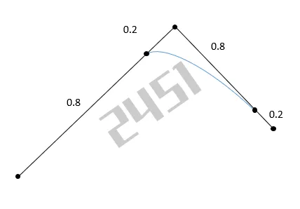
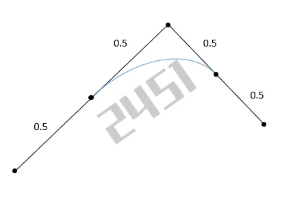

# 其他模块详细指南

## 10. 其他

### 10.1 兼容

由于 2.0 采用了新的渲染底层，为了保持 2.0 的渲染效果与 1.0 尽可能一致，可以在初始化时开启渲染效果的兼容模式：

```javascript
const app = new THING.App({ compatibleOptions: { rendering: true } })
```

### 10.2 数学

#### 介绍

ThingJS 引擎的一个主要目标是尽量降低对3D专业概念的学习和使用门槛，并在接口中最大限度地减少数学相关内容。然而，仍有少量概念和接口可能是需要了解的：

- **三维向量**：可以直接使用数组[x, y, z]；
- **四元数**：可以直接使用数组[x, y, z, w]；
- **颜色值**：使用#FF0000或数组[r, g, b]（需要注意的是rgb取值范围是 0~1 之间），也可以使用'red', 'green'等内置颜色的字符串；
- **时间**：单位一般为毫秒ms，如：2000ms为 2秒。

ThingJS 引擎数学相关的方法都在THING.Math名字空间下，其中一些常用的方法举例：

#### 向量方法

```javascript
// 向量相加
let v3 = THING.Math.addVector(v1, v2)
// 向量相减少
let v3 = THING.Math.subVector(v1, v2)
// 向量长度
let len = THING.Math.getVectorLength(v)
// 计算向量差值
let len = THING.Math.lerpVector(start, end, alpha)
// 计算距离
let dis = THING.Math.getDistance(v1, v2)
// 判断向量相等
let dis = THING.Math.equalsVector(v1, v2)
```

#### 随机方法

```javascript
// 随机三维点
THING.Math.randomVector([-20, -20, -20], [20, 20, 20])
// 随机数组中的元素
THING.Math.randomFromArray(['red', 'green', 'orange', 'yellow', 'gray'])
// 随机对象中的元素，比如随机一个枚举中的枚举值
THING.Math.randomFromObject(THING.ViewModeType)
```

#### API

下面是 ThingJS 引擎提供数学相关API。

##### equalsNumber

判断数值是否相等。

**参数：**
| 变量名 | 类型 | 描述 | 默认值 |
|-------|------|------|--------|
| v1 | Number | 第一个数值。 | |
| v2 | Number | 第二个数值。 | |
| epsilon | Number | 最小误差范围。 | 0.0001 |

**返回值：**
Boolean

##### generateUUID

生成唯一识别码（Universally Unique Identifier）。

**参数：**
无

**返回值：**
String

##### clamp

获取数值限制范围内的值。

**参数：**
| 变量名 | 类型 | 描述 |
|-------|------|------|
| value | Number | 当前数值。 |
| min | Number | 最小数值。 |
| max | Number | 最大数值。 |

**返回值：**
Number

##### randomBoolean

生成随机的布尔值数值。

**参数：**
无

**返回值：**
Boolean

##### randomFloat

随机获取指定范围内的随机浮点数数值。

**参数：**
| 变量名 | 类型 | 描述 | 默认值 |
|-------|------|------|--------|
| min | Number | 最小数值，可为负数。 | 0 |
| max | Number | 最大数值，可为负数。 | 0xFFFFFFFF |

**返回值：**
Number

##### randomInt

随机获取指定范围内的随机有符号整数数值。

**参数：**
| 变量名 | 类型 | 描述 | 默认值 |
|-------|------|------|--------|
| min | Number | 最小数值，可为负数。 | 0 |
| max | Number | 最大数值，可为负数。 | 0xFFFFFFFF |

**返回值：**
Number

##### randomIndexFromArray

随机获取指定数组元素个数范围内的下标值，最大数值为：数组的元素个数总数 -1。

**参数：**
| 变量名 | 类型 | 描述 |
|-------|------|------|
| arr | Array.<any> | 数组 |

**返回值：**
Number

##### randomFromArray

随机获取指定数组的元素。

**参数：**
| 变量名 | 类型 | 描述 |
|-------|------|------|
| arr | Array.<any> | 数组 |

**返回值：**
Any

##### randomKeyFromObject

随机获取指定对象的成员变量名。

**参数：**
| 变量名 | 类型 | 描述 |
|-------|------|------|
| object | Object | 对象 |
| excludeKey | String Array.<String> | 需要排除的成员变量名（列表） |

**返回值：**
String

##### randomFromObject

随机获取指定对象的成员变量值。

**参数：**
| 变量名 | 类型 | 描述 |
|-------|------|------|
| object | Object | 对象 |
| excludeKey | String Array.<String> | 需要排除的成员变量名（列表） |

**返回值：**
Any

##### degToRad

将角度值转换为弧度值。

**参数：**
| 变量名 | 类型 | 描述 |
|-------|------|------|
| degree | Number | 角度值 |

**返回值：**
Number

##### radToDeg

将弧度值转换为角度值。

**参数：**
| 变量名 | 类型 | 描述 |
|-------|------|------|
| radian | Number | 弧度值 |

**返回值：**
Number

##### anglesToRadians

将多个角度值转换为多个弧度值。

**参数：**
| 变量名 | 类型 | 描述 |
|-------|------|------|
| angles | Array.<Number> | 多个角度值 |

**返回值：**
Array.<Number>

##### radiansToAngles

将多个弧度值转换为角度值。

**参数：**
| 变量名 | 类型 | 描述 |
|-------|------|------|
| radians | Array.<Number> | 多个弧度值 |

**返回值：**
Array.<Number>

##### isPrime

判断数值是否为质数。

**参数：**
| 变量名 | 类型 | 描述 |
|-------|------|------|
| value | Number | 数值 |

**返回值：**
Boolean

##### ceilAlign

获取按照指定对齐值进行数值对齐后的最大值。

**参数：**
| 变量名 | 类型 | 描述 |
|-------|------|------|
| value | Number | 数值 |
| alignedValue | Number | 对齐值 |

**返回值：**
Number

##### floorAlign

获取按照指定对齐值进行数值对齐后的最小值。

**参数：**
| 变量名 | 类型 | 描述 |
|-------|------|------|
| value | Number | 数值 |
| alignedValue | Number | 对齐值 |

**返回值：**
Number

##### isPowerOfTwo

判断数值是否二次幂数值。

**参数：**
| 变量名 | 类型 | 描述 |
|-------|------|------|
| value | Number | 数值 |

**返回值：**
Boolean

##### ceilPowerOfTwo

获取按照二次幂进行数值处理的最大值。

**参数：**
| 变量名 | 类型 | 描述 |
|-------|------|------|
| value | Number | 数值 |

**返回值：**
Number

##### floorPowerOfTwo

获取按照二次幂进行数值处理的最小值。

**参数：**
| 变量名 | 类型 | 描述 |
|-------|------|------|
| value | Number | 数值 |

**返回值：**
Number

##### toInteger

将数值转换为整数类型。

**参数：**
| 变量名 | 类型 | 描述 |
|-------|------|------|
| value | Number | 数值 |

**返回值：**
Number

##### fract

返回数值的小数部分。

🚩注意：

返回值只能为正数，如果输入数值为负数，则会返回 1 - x 的结果（x为负数的小数部分），参考下面的代码示例。

**参数：**
| 变量名 | 类型 | 描述 |
|-------|------|------|
| x | Number | 数值 |

**返回值：**
Number

**示例：**

```javascript
THING.Math.fract(1.9) // 结果为：0.89999...9
THING.Math.fract(-1.9) // 结果为：0.10000...9
```

##### swapArray

交换数组中的两个元素。

**参数：**
| 变量名 | 类型 | 描述 |
|-------|------|------|
| arr | Array.<any> | 数组 |
| index1 | Number | 第一个参数的下标值 |
| index2 | Number | 第二个参数的下标值 |

**返回值：**
Array.<any>

##### roundUp

将数值进行四舍五入处理。

**参数：**
| 变量名 | 类型 | 描述 |
|-------|------|------|
| value | Number | 数值 |
| length | Number | 小数点保留长度 |

**返回值：**
Number

##### toHexNumberString

将数值转换成十六进制数值格式。

**参数：**
| 变量名 | 类型 | 描述 |
|-------|------|------|
| value | Number | 数值，只能接收整数类型。 |
| pattern | String | 十六进制格式化模板，默认为32位模式。 |

**返回值：**
String

**示例：**

```javascript
THING.Math.toHexNumberString(999) // 结果为：'000003e7'
THING.Math.toHexNumberString(999, '0000') // 结果为：'03e7'
THING.Math.toHexNumberString(123456, '0000000') // 结果为：'001e240'
THING.Math.toHexNumberString(-20, '0000000') // 结果为：'-0000014'
```

##### getDistanceToSquared

获取指定坐标间的距离数值(忽略开平方函数操作)。

**参数：**
| 变量名 | 类型 | 描述 |
|-------|------|------|
| v1 | Array.<Number> | 第一个坐标数据 |
| v2 | Array.<Number> | 第二个坐标数据 |

**返回值：**
Number

##### getDistance

获取指定坐标间的距离数值。

**参数：**
| 变量名 | 类型 | 描述 |
|-------|------|------|
| v1 | Array.<Number> | 第一个坐标数据 |
| v2 | Array.<Number> | 第二个坐标数据 |

**返回值：**
Number

##### getDurationFromSpeed

通过速度，获取持续时间。

**参数：**
| 变量名 | 类型 | 描述 |
|-------|------|------|
| path | Array.<Number> | 路径 |
| speed | Number | 速度，单位：米/秒 |
| closure | Boolean | （可选）是否为闭合状态，true 表示闭合路径。 |

**返回值：**
Number

**示例：**

```javascript
let box = new THING.Box()
let path = [
  [0, 0, 0],
  [10, 0, 0]
]
box.movePath({
  path,
  duration: THING.MathUtils.getDurationFromSpeed(path, 4)
})
```

##### randomVector

生成指定范围 [min, max] 内的随机坐标值。

**参数：**
| 变量名 | 类型 | 描述 |
|-------|------|------|
| min | Array.<Number> | 最小坐标数据 |
| max | Array.<Number> | 最大坐标数据 |

**返回值：**
Array.<Number>

##### randomVector2Range

在 [min, max] 范围内，生成随机坐标值 [x, y]。

**参数：**
| 变量名 | 类型 | 描述 |
|-------|------|------|
| min | Number | 最小值 |
| max | Number | 最大值 |

**返回值：**
Array.<Number>

##### randomVector3Range

在 [min, max] 范围内，生成随机坐标值 [x, y, z]。

**参数：**
| 变量名 | 类型 | 描述 |
|-------|------|------|
| min | Number | 最小值 |
| max | Number | 最大值 |

**返回值：**
Array.<Number>

##### randomColor

生成随机颜色值。

**参数：**
无

**返回值：**
Number

##### lerp

获取数值插值处理结果值。

**参数：**
| 变量名 | 类型 | 描述 |
|-------|------|------|
| start | Number | 起始数值 |
| end | Number | 终点数值 |
| alpha | Number | 插值进度，为 [0~1] 之间的数据 |

**返回值：**
Number

##### lerpVector

获取向量插值处理结果值。

**参数：**
| 变量名 | 类型 | 描述 |
|-------|------|------|
| start | Array.<Number> | 起始向量 |
| end | Array.<Number> | 终点向量 |
| alpha | Number | 插值进度，为 [0~1] 之间的数据 |
| result | Array.<Number> | 结果值 |

**返回值：**
Array.<Number>

##### equalsVector

判断坐标或向量是否相等。

**参数：**
| 变量名 | 类型 | 描述 |
|-------|------|------|
| v1 | Array.<Number> | 起始向量 |
| v2 | Array.<Number> | 终点向量 |
| epsilon | Number | 最小误差值，默认值为 0.001。 |

**返回值：**
Boolean

##### equalsVector3

检查 [XYZ] 向量是否相等。

**参数：**
| 变量名 | 类型 | 描述 |
|-------|------|------|
| v1 | Array.<Number> | 起始向量 |
| v2 | Array.<Number> | 终点向量 |
| epsilon | Number | 最小误差值，默认值为 0.001。 |

**返回值：**
Boolean

##### exactEqualsVector3

检查 [XYZ] 向量是否精确匹配。

**参数：**
| 变量名 | 类型 | 描述 |
|-------|------|------|
| v1 | Array.<Number> | 第一个向量 |
| v2 | Array.<Number> | 第二个向量 |

**返回值：**
Boolean

##### isZeroVector

判断坐标值是否为原点坐标 [0, 0, 0]。

**参数：**
| 变量名 | 类型 | 描述 |
|-------|------|------|
| v | Array.<Number> | 坐标数据 |

**返回值：**
Boolean

##### isParallelVector

判断 [XYZ] 向量是否平行。

**参数：**
| 变量名 | 类型 | 描述 |
|-------|------|------|
| v1 | Array.<Number> | 第一个向量 |
| v2 | Array.<Number> | 第二个向量 |

**返回值：**
Boolean

##### addVector

获取向量相加的结果。

**参数：**
| 变量名 | 类型 | 描述 |
|-------|------|------|
| v1 | Array.<Number> | 第一个向量 |
| v2 | Array.<Number> | 第二个向量 |
| result | Array.<Number> | （可选）结果 |

**返回值：**
Array.<Number>

##### subVector

获取向量相减的结果。

**参数：**
| 变量名 | 类型 | 描述 |
|-------|------|------|
| v1 | Array.<Number> | 第一个向量 |
| v2 | Array.<Number> | 第二个向量 |
| result | Array.<Number> | （可选）结果 |

**返回值：**
Array.<Number>

##### scaleVector

获取向量相乘的结果。

**参数：**
| 变量名 | 类型 | 描述 |
|-------|------|------|
| v | Array<Number> | 第一个向量 |
| scale | Array.<Number> | 缩放系数或第二个向量 |
| result | Array.<Number> | （可选）结果 |

**返回值：**
Array<Number>

**示例：**

```javascript
THING.Math.scaleVector([1, 2, 3], 10) // 结果为：[10, 20, 30]
THING.Math.scaleVector([1, 2, 3], [10, 10, 10]) // 结果为：[10, 20, 30]
THING.Math.scaleVector([1, 2, 3], [1, 2, 3]) // 结果为：[1, 4, 9]
```

##### divideVector

获取向量相除的结果。

**参数：**
| 变量名 | 类型 | 描述 |
|-------|------|------|
| v | Array<Number> | 第一个向量 |
| scale | Array.<Number> | 被除系数或第二个向量 |
| result | Array.<Number> | （可选）结果 |

**返回值：**
Array.<Number>

**示例：**

```javascript
THING.Math.divideVector([1, 2, 3], 10) // 结果为： [0.1, 0.2, 0.3]
THING.Math.divideVector([1, 2, 3], [10, 10, 10]) // 结果为：[0.1, 0.2, 0.3]
THING.Math.divideVector([1, 2, 3], [1, 2, 3]) // 结果为：[1, 1, 1]
```

##### clampVector

获取坐标在指定限制范围内的位置值。

**参数：**
| 变量名 | 类型 | 描述 |
|-------|------|------|
| v | Array.<Number> | 坐标数据 |
| min | Array.<Number> | 最小坐标数据 |
| max | Array.<Number> | 最大坐标数据 |
| result | Array.<Number> | （可选）结果 |

**返回值：**
Array.<Number>

**示例：**

```javascript
THING.Math.clampVector([1, 2, 3], [5, 0, 5], [10, 1, 10]) // 结果为：[5, 1, 5]
```

##### dotVector

获取两个向量的点积数值。

**参数：**
| 变量名 | 类型 | 描述 |
|-------|------|------|
| v1 | Array.<Number> | 第一个向量 |
| v2 | Array.<Number> | 第二个向量 |

**返回值：**
Number

**示例：**

```javascript
THING.Math.dotVector([0, 1, 0], [1, 0, 0]) // 结果为：0
```

##### crossVector

获取两个向量的叉积（向量）。

**参数：**
| 变量名 | 类型 | 描述 |
|-------|------|------|
| v1 | Array.<Number> | 第一个向量 |
| v2 | Array.<Number> | 第二个向量 |
| result | Array.<Number> | （可选）结果 |

**返回值：**
Array.<Number>

**示例：**

```javascript
THING.Math.crossVector([0, 1, 0], [1, 0, 0]) // 结果为：[0, 0, -1]
```

##### negVector

获取反方向的向量。

**参数：**
| 变量名 | 类型 | 描述 |
|-------|------|------|
| v | Array.<Number> | 向量 |
| result | Array.<Number> | （可选）结果 |

**返回值：**
Array.<Number>

**示例：**

```javascript
THING.Math.negVector([0, 1, 0]) // 结果为：[-0, -1, -0]
```

##### normalizeVector

获取归一化的向量。

**参数：**
| 变量名 | 类型 | 描述 |
|-------|------|------|
| v | Array.<Number> | 向量 |

**返回值：**
Array.<Number>

**示例：**

```javascript
THING.Math.normalizeVector([2, 4, 6]) // 结果为：[0.5773502691896258, 0.5773502691896258, 0.5773502691896258]
```

##### minVector

获取最小的坐标数据。

**参数：**
| 变量名 | 类型 | 描述 |
|-------|------|------|
| points | Array.<Array.<Number>> | 坐标列表 |

**返回值：**
Array.<Number>

**示例：**

```javascript
THING.Math.minVector([
  [-2, -4, -6],
  [-4, -7, 3],
  [2, 4, 6]
]) // 结果为：[-4, -7, -6]
```

##### maxVector

获取最大的坐标数据。

**参数：**
| 变量名 | 类型 | 描述 |
|-------|------|------|
| points | Array.<Array.<Number>> | 坐标列表 |

**返回值：**
Array.<Number>

**示例：**

```javascript
THING.Math.maxVector([
  [-2, -4, -6],
  [-4, -7, 3],
  [2, -8, 1]
]) // 结果为：[2, -4, 3]
```

##### getVec3FromMatrixColumn

获取 4x4 矩阵的行信息(前三个数值)。

**参数：**
| 变量名 | 类型 | 描述 |
|-------|------|------|
| matrix | Array.<Number> | 矩阵数据 |
| index | Number | 行下标，取值范围 [0, 3] |
| result | Array.<Number> | （可选）结果 |

**返回值：**
Array.<Number>

**示例：**

```javascript
THING.Math.getVec3FromMatrixColumn([1, 0, 0, 0, 0, 1, 0, 0, 0, 0, 1, 0, 0, 0, 0, 1], 2) // 结果为：[0, 0, 1]
```

##### transformDirection

获取向量经过指定矩阵变换后的方向。

**参数：**
| 变量名 | 类型 | 描述 |
|-------|------|------|
| vector | Array.<Number> | 向量 |
| matrix | Array.<Number> | 矩阵数据 |

**返回值：**
Array.<Number>

**示例：**

```javascript
var matrix = THING.Math.createMat4([0, 0, 0], [45, 45, 0], [2, 2, 2])
THING.Math.transformDirection([0, 10, 0], matrix) // 结果为：[5.551115123125784e-17, 0.7071067811865476, 0.7071067811865476]
```

##### getVectorLength

获取向量的长度。

**参数：**
| 变量名 | 类型 | 描述 |
|-------|------|------|
| v | Array.<Number> | 向量 |

**返回值：**
Number

**示例：**

```javascript
THING.Math.getVectorLength([3, 4, 5]) // 结果为：7.07106781186547554
```

##### getVectorLengthSquared

获取向量的长度（忽略开平方函数操作）。

**参数：**
| 变量名 | 类型 | 描述 |
|-------|------|------|
| v | Array.<Number> | 向量 |

**返回值：**
Number

**示例：**

```javascript
THING.Math.getVectorLengthSquared([3, 4, 5]) // 结果为：50
```

##### getDirection

获取第一向量到第二向量的向量方向。

**参数：**
| 变量名 | 类型 | 描述 |
|-------|------|------|
| v1 | Array.<Number> | 第一个向量 |
| v2 | Array.<Number> | 第二个向量 |

**返回值：**
Array.<Number>

**示例：**

```javascript
THING.Math.getDirection([0, 10, 0], [0, -10, 0]) // 结果为：[0, -1, 0]
```

##### getDistanceFromPoints

获取坐标列表的总长度。

**参数：**
| 变量名 | 类型 | 描述 |
|-------|------|------|
| points | Array.<Array.<Number>> | 坐标列表 |
| closure | Boolean | 是否为闭环坐标列表，默认为 false |

**返回值：**
Number

**示例：**

```javascript
THING.Math.getDistanceFromPoints(
  [
    [0, 0, 0],
    [10, 0, 0],
    [10, 10, 0],
    [0, 10, 0]
  ],
  true
) // 结果为：40
```

##### getCenterFromPoints

获取坐标列表中心位置。

**参数：**
| 变量名 | 类型 | 描述 |
|-------|------|------|
| points | Array.<Array.<Number>> | 坐标列表 |

**返回值：**
Array.<Number>

##### toUniquePoints

获取经过排重后的坐标列表。

**参数：**
| 变量名 | 类型 | 描述 |
|-------|------|------|
| points | Array.<Array.<Number>> | 坐标列表 |
| epsilon | Number | 最小误差范围，默认为 0.0001 |

**返回值：**
Array.<Array.<Number>>

**示例：**

```javascript
THING.Math.toUniquePoints([
  [0, 0, 0],
  [0.00000001, 0, 0],
  [10.0001, 0, 0],
  [10, 10, 0],
  [0, -0.001, 0]
]) // 结果为：[[0, 0, 0], [10.0001, 0, 0], [10, 10, 0], [0, -0.001, 0]]
```

##### getAngleBetweenVectors

获取两向量间的角度值。

**参数：**
| 变量名 | 类型 | 描述 |
|-------|------|------|
| v1 | Array.<Number> | 第一个向量 |
| v2 | Array.<Number> | 第二个向量 |

**返回值：**
Number

**示例：**

```javascript
THING.Math.getAngleBetweenVectors([0, 1, 0], [1, 0, 0]) // 结果为：90
```

##### getArea

获取坐标（2D）范围内的面积值。

**参数：**
| 变量名 | 类型 | 描述 |
|-------|------|------|
| points | Array.<Array.<Number>> | 坐标列表 |

**返回值：**
Number

**示例：**

```javascript
THING.Math.getArea([
  [0, 0],
  [10, 0],
  [10, 10],
  [0, 10]
]) // 结果为：100
```

##### isClockWise

判断坐标列表遍历是否为顺时针方向。

**参数：**
| 变量名 | 类型 | 描述 |
|-------|------|------|
| points | Array.<Array.<Number>> | 坐标列表 |

**返回值：**
Boolean

**示例：**

```javascript
THING.Math.isClockWise([
  [0, 0],
  [10, 0],
  [10, 10],
  [0, 10]
]) // 结果为：false

THING.Math.isClockWise([
  [0, 10],
  [10, 10],
  [10, 0],
  [0, 0]
]) // 结果为：true
```

##### makeClockWisePoints

顺时针方向遍历坐标列表。

**参数：**
| 变量名 | 类型 | 描述 |
|-------|------|------|
| points | Array.<Array.<Number>> | 坐标列表 |

**返回值：**
Array.<Array.<Number>>

##### getDirectionFromAngles

获取从水平角度到垂直角度的偏移量。

**参数：**
| 变量名 | 类型 | 描述 |
|-------|------|------|
| horzAngle | Number | 水平角度，0 表示 z 轴正方向 |
| vertAngle | Number | 垂直角度，90 表示 y 轴正方向 |

**返回值：**
Array.<Number>

##### getOffsetFromAngles

通过角度获取偏离位置。

**参数：**
| 变量名 | 类型 | 描述 |
|-------|------|------|
| horzAngle | Number | 水平角度 |
| vertAngle | Number | 垂直角度 |
| distance | Number | 距离 |

**返回值：**
Array.<Number>

##### getAnglesFromOffset

通过偏离位置获取水平角度和垂直角度。返回数组，数组的下标值：0 - 水平角度，1 - 垂直角度

**参数：**
| 变量名 | 类型 | 描述 |
|-------|------|------|
| offset | Array.<Number> | 偏离位置 |

**返回值：**
Array.<Number>

##### toPlanePoints

转换为平面上的点。

**参数：**
| 变量名 | 类型 | 描述 |
|-------|------|------|
| points | Array.<Array.<Number>> | 点数组 |

**返回值：**
Array.<Array.<Number>>

##### slerp

四元数线性插值方法。

**参数：**
| 变量名 | 类型 | 描述 |
|-------|------|------|
| start | Array.<Number> | 起始数值 |
| end | Array.<Number> | 终止数值 |
| alpha | Number | 插值进度，为 [0~1] 之间的数据 |

**返回值：**
Array.<Number>

##### lookAt

根据观察位置、目标位置和上方向获得矩阵数据（4X4 矩阵）。

**参数：**
| 变量名 | 类型 | 描述 |
|-------|------|------|
| eye | Array.<Number> | 观察者位置 |
| center | Array.<Number> | 观察者朝向的位置 |
| up | Array.<Number> | 上方向 |

**返回值：**
Array.<Number>

##### getQuatFromAxisRadian

通过坐标轴和弧度值获取四元数。

**参数：**
| 变量名 | 类型 | 描述 |
|-------|------|------|
| axis | Array.<Number> | 坐标轴 |
| radian | Number | 弧度值 |
| target | Array.<Number> | 引用的目标对象的值 |

**返回值：**
Array.<Number>

##### getQuatFromAxisAngle

通过坐标轴和角度获取四元数。

**参数：**
| 变量名 | 类型 | 描述 |
|-------|------|------|
| axis | Array.<Number> | 坐标轴 |
| angle | Number | 角度 |
| target | Array.<Number> | 引用的目标对象的值 |

**返回值：**
Array.<Number>

##### getQuatFromAngles

从角度（'XYZ'）转换为四元数。

**参数：**
| 变量名 | 类型 | 描述 |
|-------|------|------|
| angles | Array.<Number> | 角度 |

**返回值：**
Array.<Number>

##### getQuatFromEuler

从欧拉角弧度（'XYZ'）转换为四元数。

**参数：**
| 变量名 | 类型 | 描述 |
|-------|------|------|
| euler | Array.<Number> | 欧拉角（弧度值） |

**返回值：**
Array.<Number>

##### getQuatFromMat4

获取 4x4 矩阵的四元数。

**参数：**
| 变量名 | 类型 | 描述 |
|-------|------|------|
| mat | Array.<Number> | 4x4 矩阵 |

**返回值：**
Array.<Number>

##### getQuatFromTarget

获取从目标位置到观察者位置的四元数。

**参数：**
| 变量名 | 类型 | 描述 |
|-------|------|------|
| eye | Array.<Number> | 观察者位置 |
| center | Array.<Number> | 观察者朝向的位置 |
| up | Array.<Number> | 上方向 |

**返回值：**
Array.<Number>

##### getEulerFromQuat

获取欧拉角度的四元数。

**参数：**
| 变量名 | 类型 | 描述 |
|-------|------|------|
| quat | Array.<Number> | 四元数 |
| target | Array.<Number> | 引用的目标对象的值 |

**返回值：**
Array.<Number>

##### getAnglesFromQuat

通过四元数获取角度。

**参数：**
| 变量名 | 类型 | 描述 |
|-------|------|------|
| quat | Array.<Number> | 四元数 |
| target | Array.<Number> | 引用的目标对象的值 |

**返回值：**
Array.<Number>

##### pixelToScreenCoordinate

转换像素转换为屏幕坐标 [-1, 1]。

**参数：**
| 变量名 | 类型 | 描述 |
|-------|------|------|
| position | Array.<Number> | 位置 |

**返回值：**
Array.<Number>

##### screenCoordinateToPixel

屏幕坐标 [-1, 1] 转换为像素。

**参数：**
| 变量名 | 类型 | 描述 |
|-------|------|------|
| position | Array.<Number> | 位置 |

**返回值：**
Array.<Number>

##### getPositionOnDirection

根据距离和指定方向，获取位置信息。

**参数：**
| 变量名 | 类型 | 描述 |
|-------|------|------|
| position | Array.<Number> | 起始位置 |
| direction | Array.<Number> | 方向 |
| scale | Number | 缩放倍数 |

**返回值：**
Array<Number>

##### getPositionOnPlane

根据指定方向，获取虚拟平面上的位置。

**参数：**
| 变量名 | 类型 | 描述 |
|-------|------|------|
| origin | Array.<Number> | 起始位置/观察者位置 |
| target | Array.<Number> | 平面上的目标位置 |
| direction | Array.<Number> | 平面上的方向 |

**返回值：**
Array.<Number>

##### createMat4

创建 4x4 矩阵。

**参数：**
| 变量名 | 类型 | 描述 |
|-------|------|------|
| position | Array.<Number> | 位置 |
| angles | Array.<Number> | 角度 |
| scale | Array.<Number> | 缩放 |

**返回值：**
Array.<Number>

##### decomposeFromMat4

将此矩阵分解为其位置、四元数和比例分量。

**参数：**
| 变量名 | 类型 | 描述 |
|-------|------|------|
| matrix | Array.<Number> | 矩阵 |
| position | Array.<Number> | 返回的位置 |
| angles | Array.<Number> | 返回的角度 |
| scale | Array.<Number> | 返回的缩放 |

**返回值：**
Array.<Number>

##### makeSphericalFromCartesianCoords

通过笛卡尔坐标系构造（或创建）球半径对象，包括半径、φ和θ属性。

**参数：**
| 变量名 | 类型 | 描述 |
|-------|------|------|
| vector | Array.<Number> | 坐标 |

**返回值：**
Spherical

##### makeSphericalSafe

将极角 φ 值限制在 0.000001 到 π - 0.000001 之间。

**参数：**
| 变量名 | 类型 | 描述 |
|-------|------|------|
| spherical | Spherical | 某点的球半径坐标 |

**返回值：**
Spherical

##### getFromSphericalCoords

从球半径对象的半径、φ 和 θ 中，获取矢量。

**参数：**
| 变量名 | 类型 | 描述 |
|-------|------|------|
| spherical | Sperical | 某点的球半径坐标 |

**返回值：**
Array.<Number>

##### pointInLineSegment

判断测试点是否在线段上。

**参数：**
| 变量名 | 类型 | 描述 | 默认值 |
|-------|------|------|--------|
| pointA | Array.<Number> | 点A | |
| pointB | Array.<Number> | 点B | |
| point | Array.<Number> | 测试点 | |
| deviation | Number | 偏差 | 0.001 |
| containsEndpoint | Boolean | 是否包含终点 | true |

**返回值：**
Boolean

**示例：**

```javascript
const inLineSegment = THING.MathUtils.pointInLineSegment([10, 0], [10, 10], [10, 5])
console.log(inLineSegment)
```

##### pointToLineDistance

获取测试点到线的距离。

**参数：**
| 变量名 | 类型 | 描述 |
|-------|------|------|
| pointA | Array.<Number> | 点A |
| pointB | Array.<Number> | 点B |
| point | Array.<Number> | 测试点 |

**返回值：**
Number

**示例：**

```javascript
const distance = THING.MathUtils.pointToLineDistance([10, 0], [10, 10], [10, 5])
console.log(distance)
```

##### projectionInside

判断测试点的投影点是否在线段内。

**参数：**
| 变量名 | 类型 | 描述 | 默认值 |
|-------|------|------|--------|
| pointA | Array.<Number> | 点A | |
| pointB | Array.<Number> | 点B | |
| point | Array.<Number> | 测试点 | |
| containsEndpoint | Boolean | 是否包含终点 | true |

**返回值：**
Boolean

**示例：**

```javascript
const inside = THING.MathUtils.projectionInside([10, 0], [10, 10], [10, 5])
console.log(inside)
```

##### projectPointToLineSegment

根据线段和测试点，获取投影点。

**参数：**
| 变量名 | 类型 | 描述 |
|-------|------|------|
| pointA | Array.<Number> | 点A |
| pointB | Array.<Number> | 点B |
| point | Array.<Number> | 测试点 |

**返回值：**
Array.<Number>

**示例：**

```javascript
const projectPoint = THING.MathUtils.projectPointToLineSegment([10, 0], [10, 10], [10, 5])
console.log(projectPoint)
```

##### simplifyPoints

简化点。可用于简化房间外部和内部墙体结构上的点。

**参数：**
| 变量名 | 类型 | 描述 |
|-------|------|------|
| array | Array.<Array.<Number>> | 待简化的点的数据。**注意：**这里传入的是一个房间的数据，不支持多个房间的点的简化。简化线段上的点，即在房间墙体内部和外部结构不变的情况下，保留最少的点。 |
| filterEqualpoints | Boolean | 是否过滤掉重复的点。默认为 true，表示只保留房间外围墙体，忽略房间内部墙体。 |
| deviation | Number | 向量角度偏差，单位：度。默认偏差值为 1.5度，表示将偏差角度在1.5度以内的点，视为线段上的点。 |

**返回值：**
Array.<Array.<Number>>

**示例：**

```javascript
THING.MathUtils.simplifyPoints(points, false, 3)
```

**说明：**

下图所示为 filterEqualpoints 设置为 true 或 false 时，过滤前后对比。

🚩注意：

下图所示被视为多个房间。暂不支持传入多个房间数据的点的简化。

##### intersectLineSegments

获取两条相交线段的交点位置。如果不相交，则返回null。在使用此接口前，先确认两条线段不共线。

**参数：**
| 变量名 | 类型 | 描述 |
|-------|------|------|
| a | Array.<Number> | 线段1的起点。 |
| b | Array.<Number> | 线段1的终点。 |
| c | Array.<Number> | 线段2的起点。 |
| d | Array.<Number> | 线段2的终点。 |
| deviation | Number | 向量角度偏差，将所设置范围内的点视为线段上的点。 |

**返回值：**
Array.<Number> | null

##### genSmoothPathByBezier

根据二阶贝塞尔曲线，绘制并生成平滑的移动路径。

**参数：**
| 变量名 | 类型 | 描述 |
|-------|------|------|
| path | Array.<any> | 原始移动路径。 |
| curvature | Number | 曲度，曲率。曲度的值与所绘制曲线的关系，见示意图。参数取值范围为 0.0~1.0。默认值为 0.5。 |
| divisions | Number | 细分数量。参数越大，平滑效果越细致。取值必须大于0。默认值为 50。 |

**返回值：**
Array.<any>

**示意图：**

下图所示为curvature取不同值时的效果图，黑色折线表示原始路径，蓝色曲线表示处理后生成的平滑移动路径。

| 当 curvature = 0.2 时                       | 当 curvature = 0.5 时                       |
| ------------------------------------------- | ------------------------------------------- |
|  |  |

**示例：**

```javascript
let path1 = [
  [0, 10, 0],
  [0, 10, 50],
  [50, 10, 50],
  [0, 10, 100],
  [-50, 10, 50],
  [-50, 10, 0]
]
let path2 = THING.MathUtils.genSmoothPathByBezier(path1, 0.4)
```
