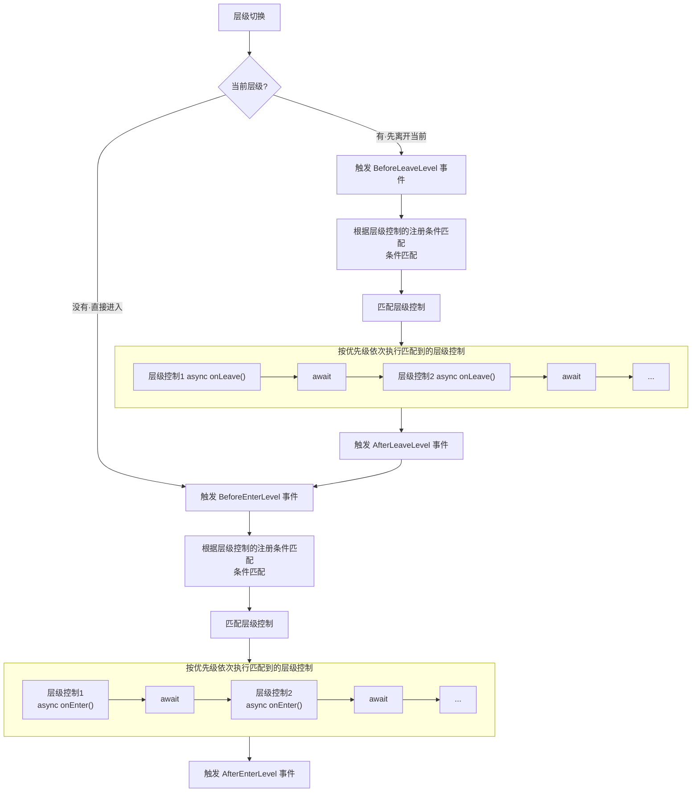
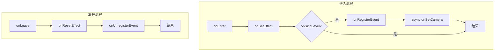
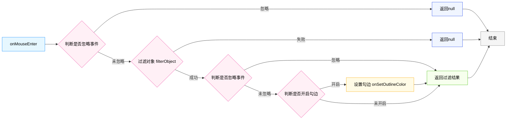
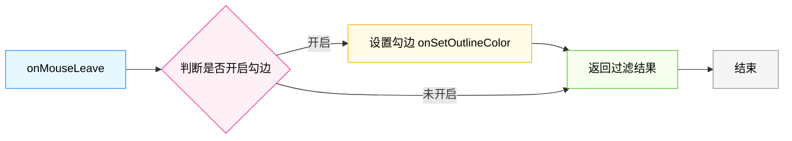
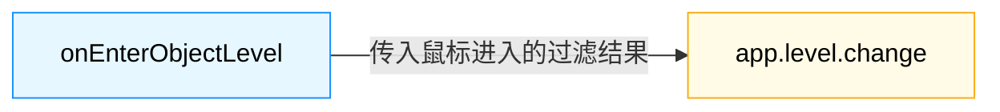
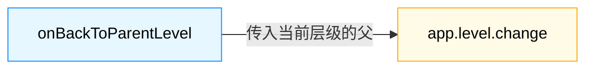

ThingJS核心提供了一套基础的层级切换流程，通过`LevelManager`进行层级之间的切换。而具体每个层级的实现，ThingJS提供了`层级控制`的概念，并配套提供了基类`BaseLevelControl`，`LevelManager`在层级切换时会调用外部注册的`层级控制`，通过这种方式实现了整个层级切换的流程。

# 层级切换流程

图片展示了层级切换的整体流程，事件的触发时机、顺序，以及与层级控制的衔接



***层级切换流程图***

# 层级控制

ThingJS提供了层级控制基类`BaseLevelControl`，有两个空实现`onEnter`和`onLeave`，分别在进出层级时触发。

园区*（THING.Campus）*的层级控制，继承基类实现了默认的层级控制`DefaultLevelControl`，在此基础上派生出六个子类，分别是根对象、园区、建筑、楼层、房间、物体，以及一些可快速设置配置项，同时也提供了自由度更高的继承重写的自定义方式，可根据项目需求自行扩展。

## 园区层级控制

### 根对象层级

类名 `RootLevelControl`

查询条件：`'.RootObject'`

生效范围：仅对RootObject生效（也就是app.root，整个场景的根节点）

实现功能：勾边处理，双击进园区

### 园区层级

类名：`CampusLevelControl`

查询条件：`'tags:or(Campus)'`

生效范围：tags中包含***Campus***的对象生效

实现功能：进园区显示室外、隐藏室内，勾边处理，双击进建筑、退回根对象 等

### 建筑层级

类名 `BuildingLevelControl`

查询条件：`'tags:or(Building)'`

生效范围：tags中包含***Building***的对象生效

实现功能：进建筑显示室内、隐藏室外，勾边处理，双击进楼层、退回园区 等

### 楼层层级

类名 `FloorLevelControl`

查询条件：`'tags:or(Floor)'`

生效范围：tags中包含***Floor***的对象生效

实现功能：进楼层隐藏其它楼层，勾边处理，双击进房间、退回建筑 等

### 房间层级

类名 `RoomLevelControl`

查询条件：`'tags:or(Room)'`

生效范围：tags中包含***Room***的对象生效

实现功能：进房间半透明其它房间，退出房间恢复半透明，双击进物体、退回楼层 等

### 物体层级

类名 `PlacementLevelControl`

查询条件：`'tags:or(Placement,Entity,Line,Geometry,Region,Window,Door)'`

生效范围：tags中包含***Placement、Entity、Line、Geometry、Region、Window、Door***的对象生效

实现功能：进物体半透明其它物体，退物体恢复半透明，双击进子级物体、退回父物体 等

## 层级控制流程

### 进出流程

进入层级从onEnter开始触发，首先调用onSetEffect处理当前层级的显隐、半透明等逻辑。接着会调用onSkipLevel判断是否跳过当前层级。不跳过接着调用onRegisterEvent注册事件（这里内部会注册一些鼠标事件）。之后调用onSetCamera(*异步函数*)执行相机飞行动画。如果是跳过当前层级那么无需注册事件，也不用设置相机，直接结束。

离开层级从OnLeave开始触发，首先调用onResetEffect对进入时做的一些操作进行恢复，然后是调用取消注册事件。



***进出层级控制流程图***

### 鼠标移入


***鼠标移入流程图***


### 鼠标移出


***鼠标移出流程图***


### 进入下一个层级

默认双击时触发


***进入下一层级流程***


### 返回上一个层级

默认双击时触发

***返回上一层级流程***


# 修改层级控制

## 配置项修改

| 属性名              | 类型                                                                             | 默认值                       |
| :------------------ | :------------------------------------------------------------------------------- | :--------------------------- |
| enableFly           | 相机飞行开关                                                                     | `true`                       |
| enableOutlineColor  | 勾边设置开关                                                                     | `true`                       |
| enableMouseEvent    | 鼠标事件开关                                                                     | `true`                       |
| enterLevelEventType | 进入层级的鼠标事件（仅限 `THING.EventType.Click` 或 `THING.EventType.DBLClick`） | `THING.EventType.DBLClick`   |
| leaveLevelEventType | 离开层级的鼠标事件（仅限 `THING.EventType.Click` 或 `THING.EventType.DBLClick`） | `THING.EventType.DBLClick`   |
| outlineColor        | 勾边颜色                                                                         | `[1, 0.5019607843137255, 0]` |

* 关闭园区层级的勾边

```javascript
var app = new THING.App();

// 加载园区
const bundle = await app.load('https://www.thingjs.com/static/models/storehouse');

// 获取园区层级控制
const campusLevelControl = app.level.controls.campus;

// 关闭勾边
campusLevelControl.enableOutlineColor = false;

// 切换到园区层级
app.level.change(bundle.campus)
```

---

* 关闭所有层级的勾边

```javascript
var app = new THING.App();

// 加载园区
const bundle = await app.load('https://www.thingjs.com/static/models/storehouse');

// 关闭所有层级勾边
app.level.controls.setControlOption('enableOutlineColor', false);

// 切换到园区层级
app.level.change(bundle.campus)
```

## 动态重写回调

* 在园区层级显示室内

```javascript
var app = new THING.App();

const bundle = await app.load('https://www.thingjs.com/static/models/storehouse');

// 获取园区层级控制
const campusLevelControl = app.level.controls.campus;

/* 重写onSetEffect，在原有逻辑的基础上把楼层显示出来 */

// 保留原来的接口 (是否保留根据具体情况决定)
campusLevelControl._oldOnSetEffect = campusLevelControl.onSetEffect;

// 重写
campusLevelControl.onSetEffect = function (param) {
    // 执行原有逻辑
    this._oldOnSetEffect(param);
    
    // 获取当前层级对象
    const current = param['current'];
    
    // 获取所有建筑
    const buildings = current.children.queryByTags('Building');
    
    // 遍历所有建筑，显示楼层
    buildings.forEach((building) => {
        // 编辑建筑的子
        building.children.forEach(bChild => {
            // 如果是楼层就显示
            if (bChild.tags.has('Floor')) {
                bChild.visible = true;
            }
        })
    })
}

// 切换层级
app.level.change(bundle.campus)
```

---

* 在园区层级禁止进入到物体层级

```javascript
var app = new THING.App();

const bundle = await app.load('https://www.thingjs.com/static/models/storehouse');

// 获取园区层级控制
const campusLevelControl = app.level.controls.campus;

/* 重写onEnterObjectLevel，判断是物体就不执行切换 */

// 不保留原有接口，直接覆盖
campusLevelControl.onEnterObjectLevel = function (object) {
	// 是Entity类型就return
	if(	object.isEntity){
		return;
	}
    
    app.level.change(object)
}

// 切换层级
app.level.change(bundle.campus)
```

---

* 禁止园区层级右键双击返回上一级

```javascript
var app = new THING.App();

const bundle = await app.load('https://www.thingjs.com/static/models/storehouse');

// 获取园区层级控制
const campusLevelControl = app.level.controls.campus;

/* 重写onBackToParentLevel，不执行任何操作 */

// 用空函数覆盖
campusLevelControl.onBackToParentLevel = function () { }

// 切换层级
app.level.change(bundle.campus)
```

---

* 重写相机飞行

```javascript
var app = new THING.App();

const bundle = await app.load('https://www.thingjs.com/static/models/storehouse');

// 获取园区层级控制
const campusLevelControl = app.level.controls.campus;

/* 重写onSetCamera，模拟从后台获取视角后再飞 */

campusLevelControl.onSetCamera = async function (param) {
	 // 模拟后台请求
    const viewpoint = await new Promise((resolve, reject)=>{
    	setTimeout(() => {
    		 // 模拟返回一个视角
            resolve({ target:[0,0,0], position:[100,100,100] })
        }, 1000)
    })
    
    app.camera.flyTo({
    	target: viewpoint.target,
    	position: viewpoint.position,
    	duration: 1000
    })
}

// 切换层级
app.level.change(bundle.campus)
```

---

* 在楼层拾取房间内的物体

```javascript
var app = new THING.App();

const bundle = await app.load('https://www.thingjs.com/static/models/storehouse');

// 将楼层下的物体放到房间下用于测试
readyTest()

// 获取楼层层级控制器
const floorLevelControl = app.level.controls.floor

// 保存原有过滤器
floorLevelControl._oldFilterObject = floorLevelControl.filterObject

// 重写过滤器，支持在楼层下拾取房间下的设备
floorLevelControl.filterObject = (object) => {
    // 过滤含有device标签的物体并返回它
    if (object.tags.has('device')) {
        return object
    }

    // 不是 device标签的 物体 执行原有逻辑
    return floorLevelControl._oldFilterObject(object)
}

// 直接切换到楼层
const floor = app.queryByUUID('108')[0]
app.level.change(floor)

/**
 * 将楼层下的物体放到房间下用于测试
 */
function readyTest() {
    const room = app.queryByUUID('121')[0]
    const floor = app.queryByUUID('108')[0]
    const devices = floor.children.query('.Entity')
    devices.forEach(device => {
        // 添加一个标签用于识别
        device.tags.add('device')
        room.add(device)
    });
}
```

---

* 双击建筑直接进房间，再右键双击直接返回园区

```javascript

var app = new THING.App();

const bundle = await app.load('https://www.thingjs.com/static/models/storehouse');

// 获取 controls
const controls = app.level.controls;

// 获取园区层级控制
const campusLevelControl = controls.campus;

/* 重写onEnterObjectLevel，双击建筑直接进到房间 */

// 保留原来的接口
campusLevelControl._oldOnEnterObjectLevel = campusLevelControl.onEnterObjectLevel;

// 重写
campusLevelControl.onEnterObjectLevel = function (object) {
    // 是建筑就直接进入房间
    if (object.tags.has('Building')) {
        const room = app.queryByUUID('547')[0]
        app.level.change(room, { jumping: true })
        return
    }

    // 如果不是建筑，就执行原有逻辑
    this._oldOnEnterObjectLevel(object);
}

// 获取房间层级控制
const roomLevelControl = controls.room;

/* 重写onBackToParentLevel ，双击直接返回到园区 */

// 重写
roomLevelControl.onBackToParentLevel = function (object) {
    // 直接返回到园区
    app.level.change(bundle.campus, { jumping: true })
}

app.level.change(bundle.campus)
```